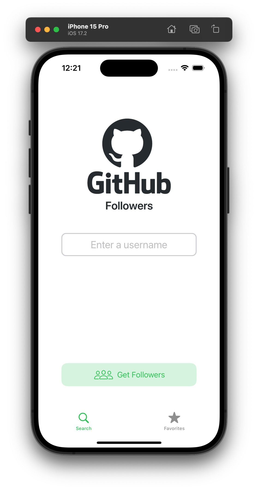
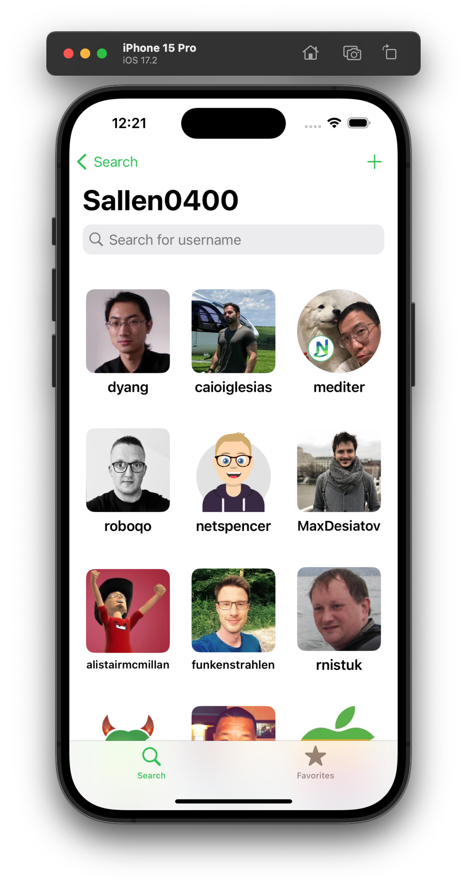
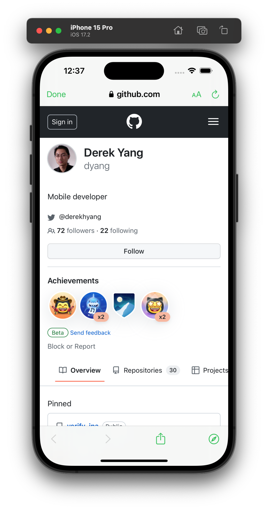
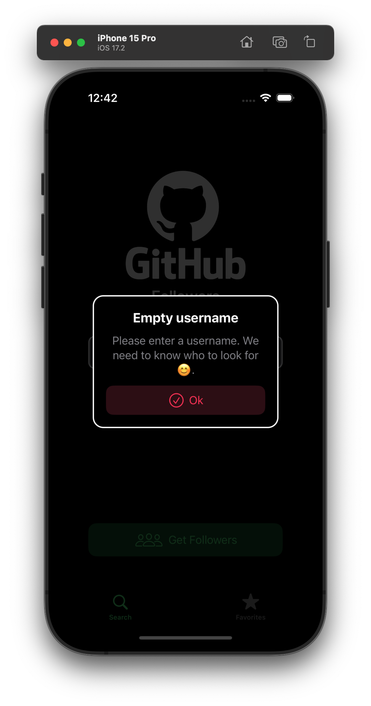
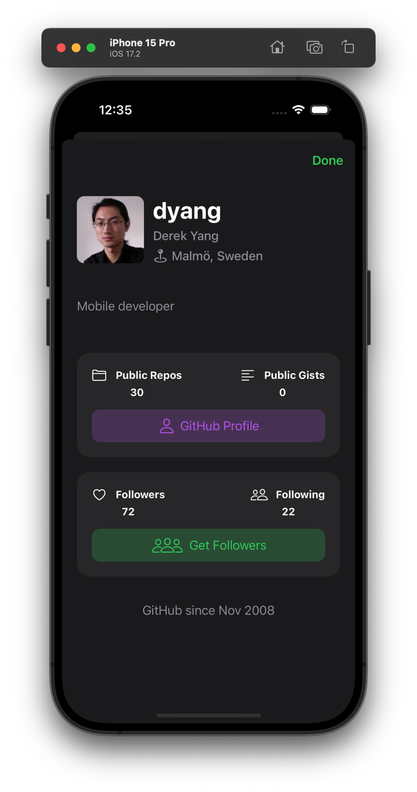
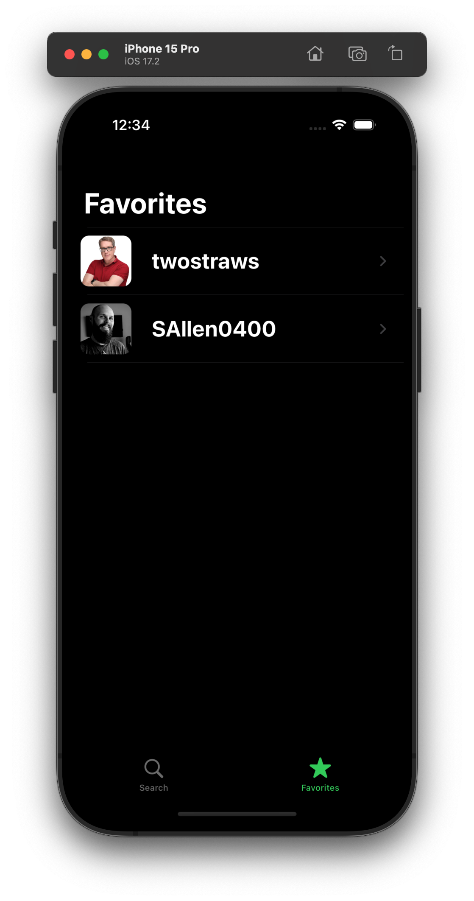
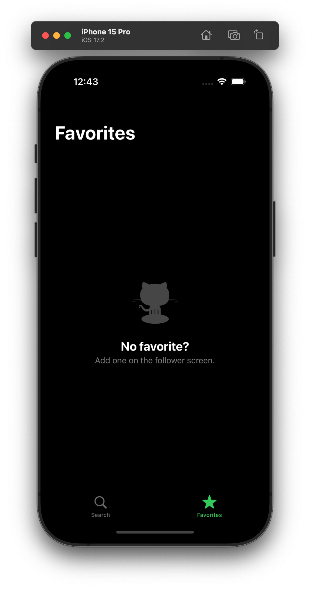

# GHFlollowers

GHFollowers provides you with the followers of any GitHub account along with additional details.

 

## Requirements

* iOS 17.0+

## Features

* This project is based on Sean Allen's course [iOS Dev Job Interview Practice - Take Home Project](https://seanallen.teachable.com/p/take-home).

* Apart from a few UI changes, there are no new features - yet - compared to the base project; however, several fixes and improvements have been made:
    * Fixed an issue where the search bar wouldn't clear after a new followers request following a search.
    * Addressed issues related to the SearchBar when swiping down the list during a search or after cancelling a search providing no result.

* UI changes:
    * Custom UIContentUnavailableConfigurationState.
    * A slight change to the buttons' appearance.

* Some parts of the code implementation and refactoring are unique but don't change the features or behavior of the app.

## Technologies Used

* UX/UI: UIKit, fully programmatically (R.I.P. storyboard), and a touch of SwiftUI.
* Asynchronous Operations: Concurrency (async/await).
* Persistent Storage and Caching: UserDefaults and NSCache.

## Architecture

* MVC.

## License

See [LICENSE](LICENSE) for details